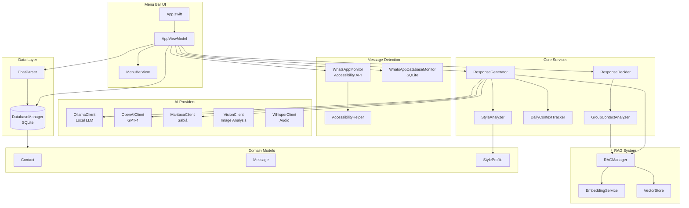
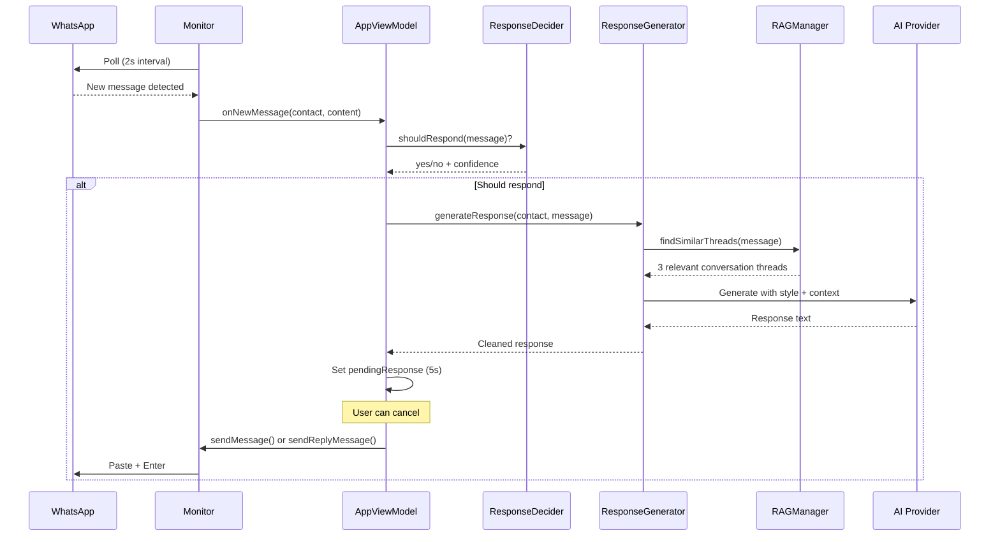

# Codebase Map

> Auto-generated by Cartographer. Last mapped: 2026-02-01

## System Overview

WhatsApp Auto Reply is a macOS menu bar application that automatically responds to WhatsApp Desktop messages using AI, mimicking the user's personal writing style based on imported chat history. It supports multiple AI providers (Ollama, OpenAI, Maritaca) with advanced features like RAG semantic search, audio transcription, image analysis, and intelligent group chat participation.



## Directory Structure

```
WhatsAppAutoReply/
├── Sources/WhatsAppAutoReply/
│   ├── App.swift                    # SwiftUI app entry + menu bar setup
│   ├── Database/
│   │   └── DatabaseManager.swift    # SQLite persistence layer
│   ├── Models/
│   │   ├── Contact.swift            # Contact entity
│   │   ├── Message.swift            # Message entity
│   │   └── StyleProfile.swift       # 40+ writing style metrics
│   ├── Monitor/
│   │   ├── AccessibilityHelper.swift    # macOS Accessibility API wrapper
│   │   ├── WhatsAppDatabaseMonitor.swift # Direct SQLite monitoring
│   │   └── WhatsAppMonitor.swift        # Accessibility-based detection
│   ├── Ollama/
│   │   ├── MaritacaClient.swift     # Maritaca AI (Portuguese LLM)
│   │   ├── OllamaClient.swift       # Local Ollama client
│   │   ├── OpenAIClient.swift       # OpenAI GPT client
│   │   ├── VisionClient.swift       # GPT-4 Vision for images
│   │   └── WhisperClient.swift      # Audio transcription
│   ├── Parser/
│   │   └── ChatParser.swift         # WhatsApp export (.zip) parser
│   ├── RAG/
│   │   ├── EmbeddingService.swift   # OpenAI embeddings
│   │   ├── RAGManager.swift         # RAG orchestration
│   │   └── VectorStore.swift        # In-memory vector search
│   ├── Services/
│   │   ├── AudioTranscriptionService.swift  # Whisper orchestrator
│   │   ├── DailyContextTracker.swift        # Today's conversation context
│   │   ├── GroupContextAnalyzer.swift       # Group topic relevance
│   │   ├── ImageAnalysisService.swift       # Vision orchestrator
│   │   ├── ResponseDecider.swift            # When to respond logic
│   │   ├── ResponseGenerator.swift          # Core AI response generation
│   │   ├── SettingsManager.swift            # UserDefaults persistence
│   │   └── StyleAnalyzer.swift              # Writing style extraction
│   └── Views/
│       ├── MenuBarView.swift        # SwiftUI menu bar interface
│       └── ViewModels/
│           └── AppViewModel.swift   # Main app state management
├── Tests/WhatsAppAutoReplyTests/
│   ├── ChatParserTests.swift
│   ├── DatabaseManagerTests.swift
│   ├── OllamaClientTests.swift
│   └── WhatsAppAutoReplyTests.swift
├── docs/plans/
│   ├── 2026-01-29-whatsapp-auto-reply-design.md
│   └── 2026-01-29-whatsapp-auto-reply-implementation.md
└── Package.swift
```

## Module Guide

### App Entry Point

| File | Purpose |
|------|---------|
| `App.swift` | SwiftUI app lifecycle, AppDelegate for menu bar |

**Entry point**: `WhatsAppAutoReplyApp` (main App struct)
**Pattern**: Menu bar app with NSStatusItem + NSPopover

---

### Database Layer

| File | Purpose |
|------|---------|
| `DatabaseManager.swift` | SQLite persistence with migrations |

**Key APIs**:
- `insertContact()`, `getAllContacts()`
- `insertMessage()`, `insertMessages()` (batch with progress)
- `updateContactStyleProfile()` (JSON storage)

**Storage**: `~/Library/Application Support/WhatsAppAutoReply/data.sqlite`

---

### Models

| File | Purpose |
|------|---------|
| `Contact.swift` | Contact/chat entity with auto-reply toggle |
| `Message.swift` | Message entity with sender enum |
| `StyleProfile.swift` | 40+ writing style metrics, Codable |

**Key Method**: `StyleProfile.toPromptDescription()` - Generates detailed style guide for LLM

---

### Monitor (Message Detection)

| File | Purpose |
|------|---------|
| `AccessibilityHelper.swift` | macOS Accessibility API wrapper |
| `WhatsAppMonitor.swift` | Accessibility-based polling (2s interval) |
| `WhatsAppDatabaseMonitor.swift` | SQLite-based polling (alternative) |

**Key APIs**:
- `checkForNewMessages()` - Detects new messages
- `sendMessage()` / `sendReplyMessage()` - Send via input field or Cmd+R
- `pasteText()` - Clipboard-based injection

**WhatsApp DB**: `~/Library/Group Containers/group.net.whatsapp.WhatsApp.shared/ChatStorage.sqlite`

---

### AI Clients

| File | Purpose |
|------|---------|
| `OllamaClient.swift` | Local Ollama (llama3.2:3b) |
| `OpenAIClient.swift` | OpenAI GPT-4 |
| `MaritacaClient.swift` | Maritaca Sabiá (Portuguese) |
| `VisionClient.swift` | GPT-4 Vision for stickers/images |
| `WhisperClient.swift` | Audio transcription |

**Pattern**: Async/await HTTP clients with consistent interface

---

### Parser

| File | Purpose |
|------|---------|
| `ChatParser.swift` | WhatsApp .zip export parser |

**Key APIs**:
- `parseZipFile()` - Extract contact + messages from export
- `isGroupChat()` - Detect groups (3+ senders)

---

### RAG System

| File | Purpose |
|------|---------|
| `EmbeddingService.swift` | OpenAI text-embedding-3-small |
| `VectorStore.swift` | In-memory cosine similarity search |
| `RAGManager.swift` | RAG orchestration with conversation threads |

**Key APIs**:
- `generateEmbeddings()` - Process chat history
- `findSimilarThreads()` - Semantic search (4-8 message threads)

**Storage**: `~/Library/Application Support/WhatsAppAutoReply/embeddings.json`

---

### Services

| File | Purpose |
|------|---------|
| `ResponseGenerator.swift` | Core AI response orchestration |
| `ResponseDecider.swift` | When to respond logic |
| `StyleAnalyzer.swift` | Extract 40+ writing style metrics |
| `DailyContextTracker.swift` | Today's conversation context |
| `GroupContextAnalyzer.swift` | Group topic relevance via RAG |
| `SettingsManager.swift` | UserDefaults persistence |
| `AudioTranscriptionService.swift` | Whisper orchestration |
| `ImageAnalysisService.swift` | Vision orchestration |

**Key File**: `ResponseGenerator.swift` - 400+ lines orchestrating:
- Style profile integration
- RAG semantic search
- Multi-provider AI
- Security (input sanitization, output validation)

---

### UI

| File | Purpose |
|------|---------|
| `AppViewModel.swift` | Main @MainActor state management |
| `MenuBarView.swift` | SwiftUI popover interface |

**Key APIs**:
- `handleNewMessage()` - Full response flow
- `importChatExport()` - Parse and import chats
- 5-second pending response with cancel

---

## Data Flow



## Key Architectural Decisions

1. **Dual Monitoring**: Accessibility API (default) + SQLite Database (fallback)
   - Accessibility: Works without file access, fragile to UI changes
   - Database: More reliable, requires file system permissions

2. **Multi-Provider AI**: Abstraction layer supporting Ollama/OpenAI/Maritaca
   - Consistent prompt engineering across providers

3. **RAG System**: Semantic search with conversation threads
   - Multi-turn threads (4-8 messages, 30min windows)
   - Cosine similarity with thresholds (0.3 pairs, 0.25 threads)

4. **Style Analysis**: 40+ linguistic metrics
   - Signature phrases, emotional patterns, anti-patterns
   - Context-aware length patterns

5. **Security Layers**:
   - Input sanitization (remove injection patterns)
   - Output validation (block AI self-references)
   - Group name trick detection

6. **Smart Decision Logic**:
   - Time-based (skip midnight-7am)
   - Message type (skip acknowledgments, respond to questions)
   - Group participation (RAG-based topic relevance)

## Conventions

- **Singletons**: DatabaseManager, RAGManager, SettingsManager
- **@MainActor**: All UI-related code (AppViewModel, Views)
- **Async/await**: All network operations
- **ObservableObject + @Published**: State management
- **Progress callbacks**: For long operations (import, embeddings)

## Gotchas

1. **Message Age**: 20-min window + 5s grace period at startup
2. **Group Renames**: Fuzzy matching + trick detection (one-time response)
3. **Clipboard Restoration**: Saves/restores when pasting (200ms delay)
4. **Batch Optimizations**: PRAGMA settings for large imports
5. **Reply Mode**: Uses Cmd+R + Cmd+Down to quote original
6. **Background Sending**: postToPid() without window focus
7. **Unicode Cleaning**: Removes LTR/RTL marks, zero-width spaces
8. **Context Cache**: Daily context invalidated at midnight

## Navigation Guide

**To add a new AI provider**:
1. Create client in `Sources/WhatsAppAutoReply/Ollama/`
2. Add provider case to `SettingsManager.AIProvider`
3. Add generation method in `ResponseGenerator.swift`
4. Add UI toggle in `MenuBarView.swift` SettingsView

**To modify response logic**:
1. Decision logic: `Services/ResponseDecider.swift`
2. Prompt engineering: `Services/ResponseGenerator.swift`
3. Style metrics: `Services/StyleAnalyzer.swift` + `Models/StyleProfile.swift`

**To add a new media type**:
1. Create service in `Services/` (like AudioTranscriptionService)
2. Add client in `Ollama/` if new AI API needed
3. Update `AppViewModel.handleNewMessage()` detection
4. Add settings toggle in `SettingsManager.swift`

**To change monitoring approach**:
1. Accessibility: `Monitor/WhatsAppMonitor.swift`
2. Database: `Monitor/WhatsAppDatabaseMonitor.swift`
3. Helper utilities: `Monitor/AccessibilityHelper.swift`

**To run tests**:
```bash
swift test
```
